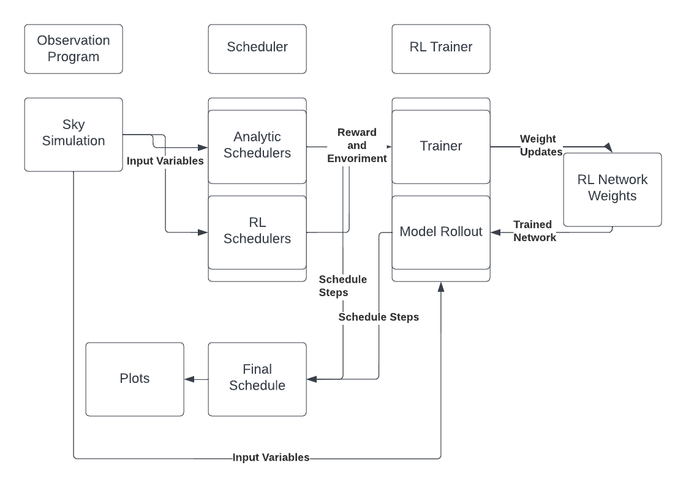

[status](https://img.shields.io/badge/License-MIT-lightgrey)]

## Summary

It's broken. :<

## Installation 

Install is currently only install from source.
It requires both this repo and the repo [SkyBright](https://github.com/ehneilsen/skybright)

Due to the limitation of rllib, a conda environment is required if running on Mac with an M1 chip, 
due to a conflict with tensorflow.

Required Packages: (install with conda if on Mac, pip works with Linux)

\\ Todo -> Different install actions in github

```
python==3.9.13

attrs==21.4.0
astroplan==0.8
astropy==5.2.dev0
gym==0.21.0
keras/tensorflow==2.9.0
numpy==1.23.1
numexpr==2.8.3
pandas==1.4.3
ray==1.13.0
```

## Quickstart
To immediately start training a model and verify your installation, use the command 
```
python3 src/trainer.py 
   --obsprog_config src/train_configs/default_obsprog.conf
   --schedule_config src/train_configs/default_schedule.conf
   --iterations 5
   --out_path results/test_schedule
```

To evaluate an already generated schedule, use the command 
```
python3 src/plotting.py 
    --schedule_path <Path to schedule csv>
    --obsprog_config src/train_configs/default_obsprog.conf
    --n_sites <Number of possible sites for a schedule to have visited> 
```

Or generate a schedule using a reinforcement learning model (verify the agent is correctly 
configured beforehand.)
```
python3 src/model_rollout.py 
    --experiment_path <Directory where the trained weights are stored, the program will 
    automatically pick the latest weight>
    --scheduler_config_path src/train_configs/default_schedule.conf
    --obs_config_path src/train_configs/default_obsprog.conf
    --start_date <Date in YYYY-MM-DDTHH:MM:SSZ>
    --end_date <Date in YYYY-MM-DDTHH:MM:SSZ>
```

## Documentation 

All inputs for each file individually can be found by passing -h as a parameter to any file, 
such as `python3 file.py -h`.


This project is split into 3 major parts. 

#### The Observation Program

The observation program is a single file (observation_program.py) which simulates a period of 
time during which the schedule is executed. It calculates parameters of the night sky as a 
function fo time and position. A single observation is considered a combination of sky 
coordinates (right accession, declination), time (in mean julian date), and observation filter 
(referred to as band). 

To start an instance of the observer, a configuration file is needed. An example can be seen in 
src/train_configs/default_obsprog.config, but briefly, it requires the position of the ground 
observatory, specifics of the types of observation it can make, and parameters for the sky 
simulation required by `skybright`. 

#### The Scheduler 
                                                                                   
The scheduler (scheduler.py) is an semi-abstract class containing the methods to automate the 
generation of sky surveys from a ground position. 

It's main function is that of a driver and recorder for the observation program. It initializes 
an instance of the observation program to use, and steps through it, selecting the next site to 
visit based on the 'select_action' function, which is left non-implemented in the abstract class. 

It has a number of children classes: 
* _Low Airmass Scheduler_ - Selects the next action based pured on what action next in time 
  sequence has the lowest airmass and is not below the horizon. 
* _Variable Schedule_ - Selects the next site based on which site at the next observation time 
  the equation `R = min(slew^3+ ha + 100*(airmass-1)^3` 
* Sequential Schedule_ - Selects the next site that is the shorted slew distance away. 
* _RL Schedule_ - Trains an RL Model that selects the weights for a selection equation dependent 
  on time, such that the selected site is picked via the equation 
 `R=min(NN_slew*slew + NN_ha*ha + NN_airmass*airmass + NN_moon angle*moon angle)`
* _Pure RL Schedule_ - Selects a site based on the selection of an RL trained network. The inputs 
  and specifics of this network can be decided in the schedule parameters file. 

Any generated schedule can be plotted and visualized via the file plotting.py. 

#### The RL Trainer and Evaluator

An RL schedule requires an extra training step to generate. The training runner (training.py) 
takes the configuration for the observation and the chosen scheduler class (assuming it is RL 
compatible) and trains it using the environment supplied in the import statements. 

\\ TODO Make the Env and Schedule class a config param

The trainer produces weights saved to the output that can later be used by `model_rollout.
py` to generate a schedule using those weights at a specific time interval, and then plots 
visualizations for the output schedule. 


A diagram of how these programs interact is given below. 


## Citation

```
@article{key , 
    author = {You :D}, 
    title = {title}, 
    journal = {journal}, 
    volume = {v}, 
    year = {20XX}, 
    number = {X}, 
    pages = {XX--XX}
}

```

## Acknowledgement 
And you <3 
